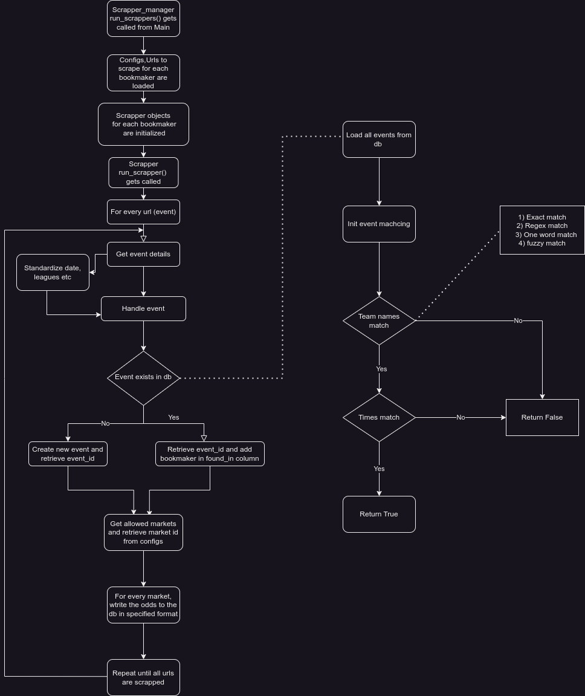

# BetEdge
An extensible dockerized full stack sports betting arbitrage application in Python.

## Components

### ```/scrappers```
A scrapping framework for collecting odds data from various bookmakers utilizing Selenium and storing them in a MySQL database. Cappable of scrapping 100s of events per minute with support for the top 4 bookmakers in Greece. Urls for events are first extracted from the bookmakers' websites and then the odds are scrapped from the extracted urls. The scrappers are designed to be extensible to support more bookmakers and markets with minimal effort.

#### Features
- Concurrent scrapping of multiple events using multiprocessing.
- Database connection pooling for concurrent database access.
- Headless scrapping for reduced resource consumption.
- Scheduler for scrapping events at regular intervals.
- Logging for debugging and error handling.
- Email notifications for encountered errors.
- Extensible to support more bookmakers and markets.
- Complete documentation and guides for adding new scrappers.
- Centralized configuration and runtime manager for all scrappers.
- Data validation and error handling for all scrappers.
- Uniform data format and standardization in the database. 
- Event matching for the same event across different bookmakers.

### Scrapping process



#### Scrapping quickstart
For a quickstart guide on how to run the scrappers, see the correspondinng [README](scrappers/README.md).

### ```/backend```
A Django REST API project for serving the odds and event data endpoints. Responsible for finding arbitrage opportunities and calculating the optimal stakes for each bet. Integrated with celery for asynchronous task execution utilizing Redis as a message broker. 

### Backend quickstart
For a quickstart guide on how to run the backend, see the correspondinng [README](backend/README.md)

### Frontend
A sample Vue.js frontend for displaying the odds and arbitrage opportunities. Currently under development, added for building purposes.

### Database
A MySQL database for storing the odds, url and event data. All sql scripts for creating the schema and adding the initial data are located in the ```/db/sql``` folder.

### Schema
The schema is comprised of 8 tables:
- ```Events```: Stores the event data.
- ```Urls```: Stores the urls for the events.
- ```Odds```: Stores the odds for the events.
- ```Bookmakers```: Stores the bookmakers ids and names.
- ```Markets```: Stores the desired markets to be scrapped.
- ```Sports```: Stores the sports available for scrapping.
- ```Arbitrage```: Stores the arbitrage opportunities, what events they appear in and the percentage of the arbitrage.
- ```ArbitrageOutcomes```: Stores the individual arbitrage legs that comprise an arbitrage opportunity. 

A complete schema diagram can be found [here](diagrams/EER10.pdf).

## Quickstart

### Docker
The easiest way to run the project is by using docker-compose. To run the project in a docker container, run the following:

1. Create a .env file in the root directory of the project with the variables defined in the ```.env.example``` file.

2. Build the docker image by running:
```bash
docker compose up --build
```
This will spin up containers for all components. Since all services rely on the database, the db container will be initialized first. Healthchecks are used to ensure that the db is ready before the other containers are initialized. The database schema is automatically created and the initial data is added by the db container.

### Settin up each service individually
If you want to run each service individually, follow the instructions provided in the corresponding ```README```.
The order in which the services should be initialized is the following:
1. Database
2. Scrappers
3. Backend
4. Frontend

## Notes
- The project is currently under development and is not ready for production use.
- Bookmakers may update their websites at any time, which may break the scrappers. If you encounter any errors, you need to update the scrappers accordingly.
